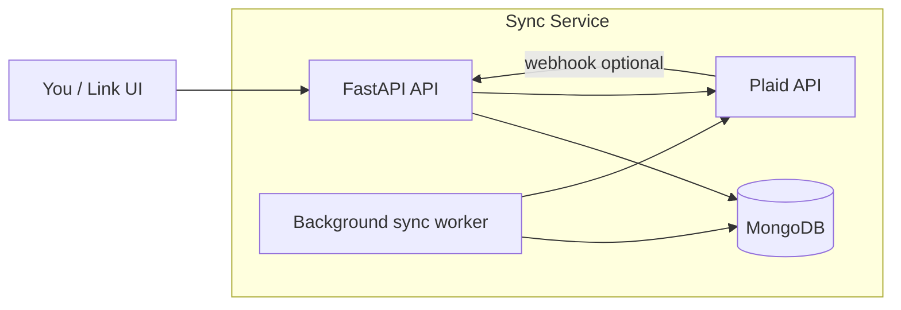

# MMM Plaid Sync Service

Continuous service that syncs Plaid transactions into **MongoDB**. Runs in Docker or Kubernetes, syncs on a schedule, and supports **adding bank accounts while the service is running**.

## Architecture



- **Items** collection: linked banks (`access_token`, `cursor`, label, sync status)
- **Accounts** collection: account metadata from `/accounts/get` + sync (`name`, `type`, `mask`, balances, full `data`)
- **Transactions** collection: upserted by `transaction_id`, with denormalized `account_display_name`, `account_mask`, etc.
- **Worker**: polls all active items every `SYNC_INTERVAL_SECONDS` (default 5 min)
- **Add account**: `POST /api/v1/link/exchange` or built-in UI at `/api/v1/link`

## Quick start (Docker)

```bash
# Edit stack.env (committed placeholders) with your Plaid + MongoDB values
docker compose up --build
```

For local runs without Compose, copy `stack.env` to `.env` (`.env` is gitignored).

## Portainer

1. Deploy this repo as a **Stack** (use `docker-compose.yml`).
2. Set environment variables from **`stack.env`** — either upload the file or paste/edit each key in Portainer’s stack env UI (replace placeholders).
3. `PORT` in `stack.env` controls both the container port and the published host mapping (`${PORT}:${PORT}`).

Do not commit real secrets into `stack.env` on a public repo; override values only in Portainer or a private env file on the host.

- API: http://localhost:47829
- Docs: http://localhost:47829/docs
- Link UI: http://localhost:47829/api/v1/link

## Local development

```bash
python -m venv .venv
.venv\Scripts\activate
pip install -r requirements.txt
# Set MONGODB_URI to your external MongoDB in .env
cp .env.example .env
python -m app.main
```

## Add a bank account (while running)

### Option A — Web UI

1. Open http://localhost:47829/api/v1/link
2. Enter a label (e.g. `chase-checking`)
3. Complete Plaid Link
4. The service stores the Item and triggers an immediate sync

### Option B — API

```bash
# 1. Create link token
curl -X POST http://localhost:47829/api/v1/link/token

# 2. Complete Plaid Link in your app with link_token → public_token

# 3. Exchange and register
curl -X POST http://localhost:47829/api/v1/link/exchange \
  -H "Content-Type: application/json" \
  -d '{"public_token": "public-production-...", "label": "chase-checking"}'
```

## API reference

| Method | Path | Description |
|--------|------|-------------|
| GET | `/api/v1/health` | Health + MongoDB ping |
| GET | `/api/v1/items` | List linked banks (Items) |
| GET | `/api/v1/items/{item_id}/accounts` | Accounts for an Item |
| GET | `/api/v1/accounts/{account_id}` | Resolve `account_id` → name, mask, type |
| POST | `/api/v1/link/token` | Create Plaid Link token |
| POST | `/api/v1/link/exchange` | Add account (`public_token`, `label`) |
| POST | `/api/v1/sync` | Sync all items now (`?reset=true` for full replay) |
| POST | `/api/v1/items/{item_id}/sync` | Sync one item |
| POST | `/api/v1/items/{item_id}/reset` | Reset cursor + full sync |
| DELETE | `/api/v1/items/{item_id}` | Deactivate item (stops syncing) |
| POST | `/api/v1/webhooks/plaid` | Plaid webhooks → trigger sync |

## Configuration

| Variable | Default | Description |
|----------|---------|-------------|
| `PLAID_CLIENT_ID` | — | Plaid client ID |
| `PLAID_SECRET` | — | Plaid secret for environment |
| `PLAID_ENV` | `sandbox` | `sandbox` or `production` |
| `PLAID_DAYS_REQUESTED` | `90` | History days at link time (max 730) |
| `PLAID_REDIRECT_URI` | — | OAuth redirect (register in Dashboard) |
| `PLAID_WEBHOOK_URL` | — | e.g. `https://host/api/v1/webhooks/plaid` |
| `MONGODB_URI` | — | **Required.** External MongoDB connection string |
| `MONGODB_DATABASE` | `mmm` | Database name |
| `SYNC_INTERVAL_SECONDS` | `300` | Background sync interval |
| `SYNC_ON_STARTUP` | `true` | Sync immediately on start |

## Kubernetes

```bash
docker build -t mmm-plaid-sync:latest .
kubectl apply -f k8s/configmap.yaml
# Create k8s/secret.yaml from k8s/secret.example.yaml
kubectl apply -f k8s/secret.yaml
kubectl apply -f k8s/deployment.yaml
```

Set `MONGODB_URI` in the ConfigMap to your external MongoDB instance.

## Resolve which account a transaction belongs to

Each transaction stores:

- `account_id` — Plaid account id (join key)
- `account_display_name`, `account_name`, `account_mask`, `account_type`, `account_subtype`, `item_label` — denormalized on sync

Lookup the account document:

```javascript
db.accounts.findOne({ account_id: "5kv581YD7BhmvrbR8j4zsOa3v1JzXbc5z4Omr" })
```

Or read fields directly on the transaction after the next sync. Re-sync existing data to backfill:

```bash
curl -X POST "http://localhost:47829/api/v1/sync?reset=false"
```

## Reset cursor / full re-sync

```bash
curl -X POST "http://localhost:47829/api/v1/sync?reset=true"
# or per item:
curl -X POST http://localhost:47829/api/v1/items/{item_id}/reset
```

## Project layout

```
app/
  main.py              # FastAPI entry + lifespan
  config.py            # Settings from env
  api/routes.py        # HTTP API + Link UI
  plaid/               # Plaid client, link, sync
  db/                  # MongoDB + repositories
  sync/service.py      # Sync orchestration
  worker/sync_worker.py
Dockerfile
docker-compose.yml
k8s/
scripts/               # Optional legacy CLI helpers
```

## Legacy scripts

The `scripts/` folder contains the original one-off CLI tools. Prefer the service API and Link UI for new usage.

## Security notes

- `access_token` values are stored in MongoDB — restrict DB access and encrypt at rest in production.
- Never expose `PLAID_SECRET` to clients; only the backend calls Plaid.
- Use `PLAID_WEBHOOK_URL` in production for timely updates instead of polling alone.
